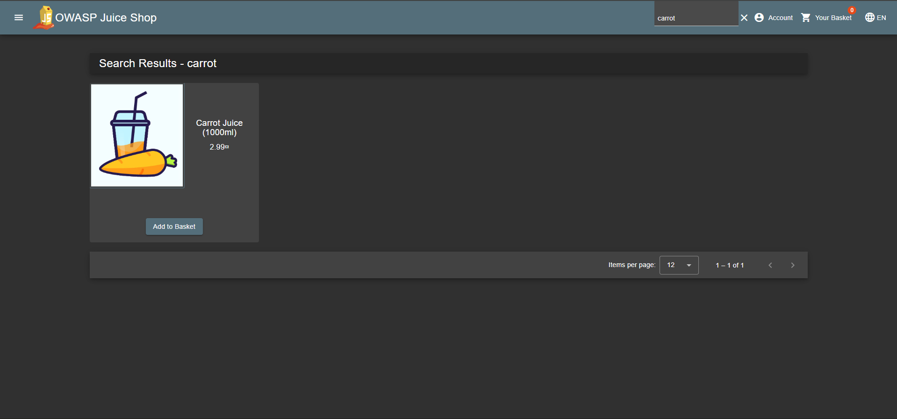
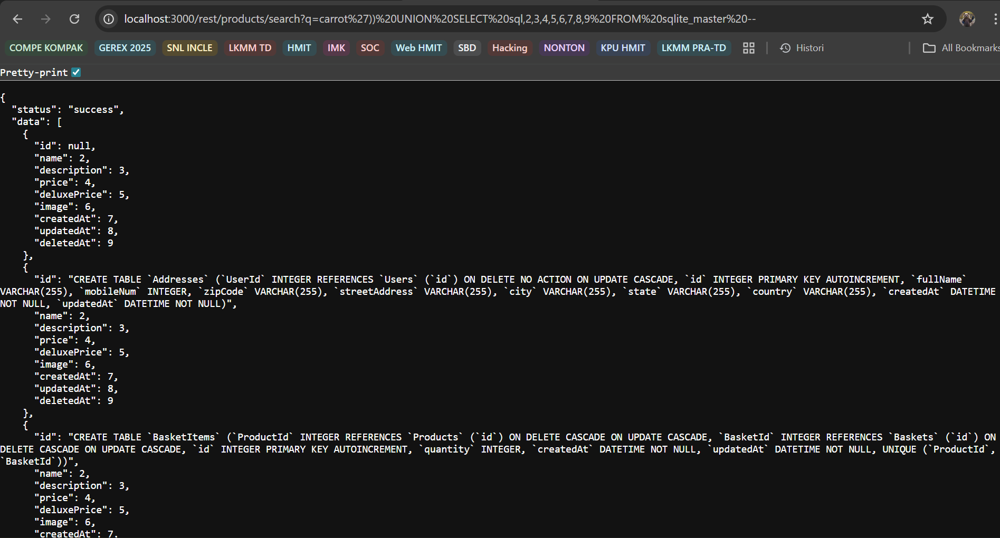
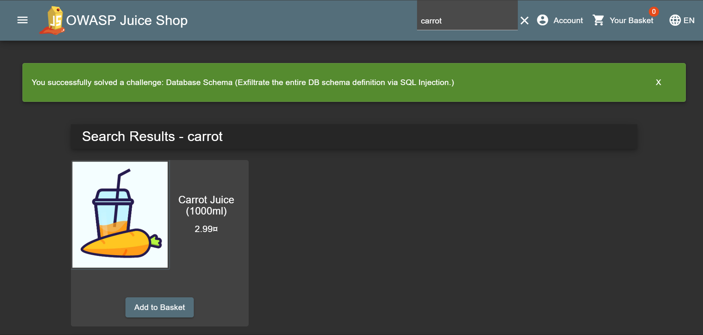
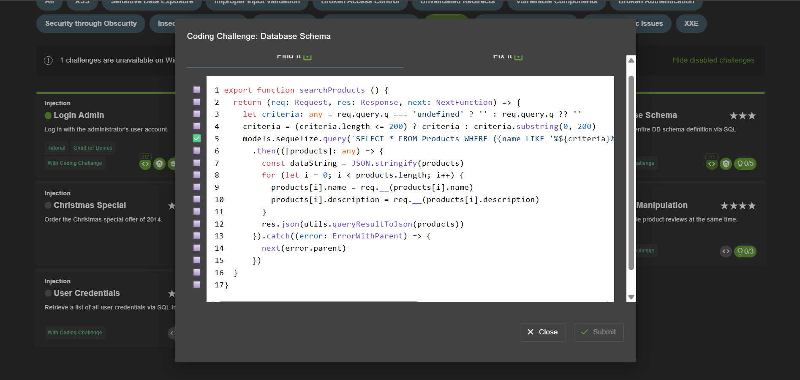
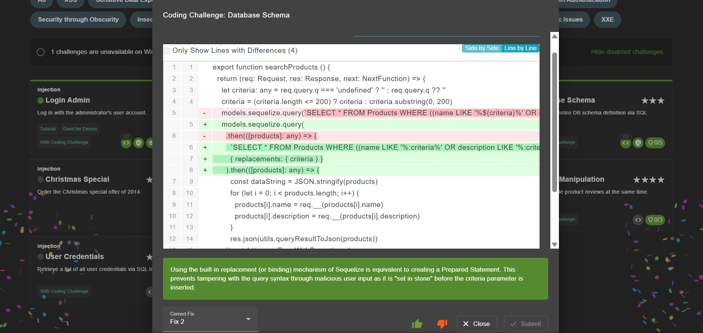

# Database Schema - OWASP Juice Shop

>Kategori = Injection☠️

[database schema](http://localhost:3000/#/score-board?categories=Injection)

---

## Langkah-langkah pengerjaan
1. Menguji untuk menemukan skema databasenya, disini melakukan pencarian bebas yang kemudian di inspect

2. Setelah dicari muncul bagian network yaitu `/search?q=` yang berisi endpoint `/rest/products/search?q=` untuk ditelusuri lebih lanjut

3. Kemudian dilanjutkan dengan menjalankan url `http://localhost:3000/rest/products/search?q=` dengan ditambahkan `carrot'))--` untuk menjalankan query nya

4. Dari hasil itu menambahkan payload `carrot')) UNION SELECT 1,2,3,4,5,6,7,8,9 FROM sqlite_master --` yang bisa digunakan untuk mengembalikan skema databasenya 

5. Hasil dari pengembalian skema databasenya dan ditambahkan payload `carrot')) UNION SELECT sql,2,3,4,5,6,7,8,9 FROM sqlite_master --` untuk menampilkan isi databasenya

6. Soal berhasil untuk diselesaikan

## Find and Fix
1. Ditemukan pada baris ke 5 dimana query dibentuk langsung dari input user tanpa replacements/binding, sehingga rawan SQL injection dan bisa menyebabkan kebocoran data

2. Perbaikan dilakukan dengan memanfaatkan fitur replacements agar input user tidak langsung dimasukkan ke query dengan begitu serangan SQL injection bisa dicegah dan akses ke database tetap aman
