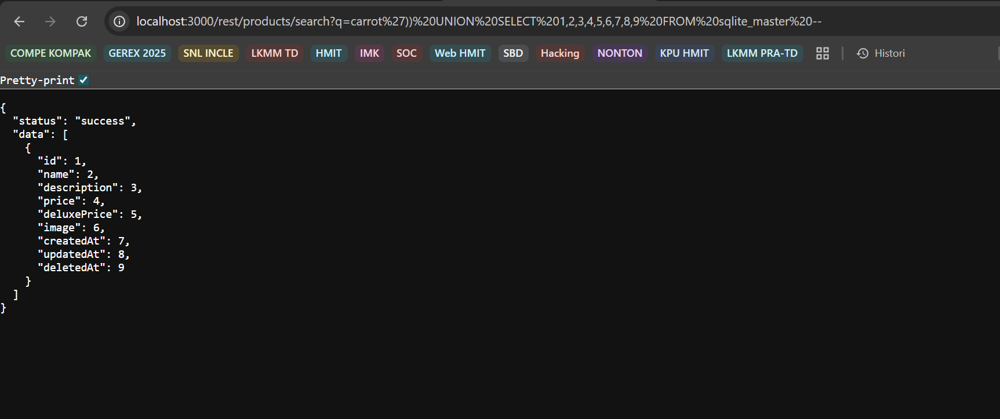

# Database Schema - OWASP Juice Shop

### Detail Informasi
---
Kategori = Injection☠️

[Database Schema](http://localhost:3000/#/score-board?categories=Injection)

## Langkah-langkah pengerjaan
1. Menguji untuk menemukan skema databasenya, disini melakukan pencarian bebas yang kemudian di inspect

2. Setelah dicari muncul bagian network yaitu `/search?q=` yang berisi endpoint `/rest/products/search?q=` untuk ditelusuri lebih lanjut

3. Kemudian dilanjutkan dengan menjalankan url `http://localhost:3000/rest/products/search?q=` dengan ditambahkan `carrot'))--` untuk menjalankan query nya

4. Dari hasil itu bisa disiapkan payload yang bisa digunakan untuk mengembalikan skema databasenya 

5. Hasil dari pengembalian skema databasenya

6. Soal berhasil untuk diselesaikan (solve)

## Find and Fix
1. 

2.
