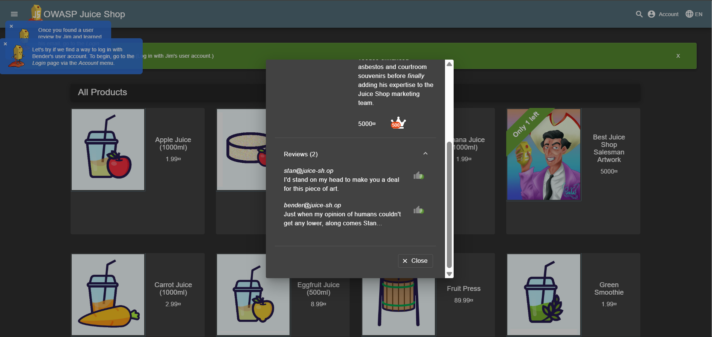
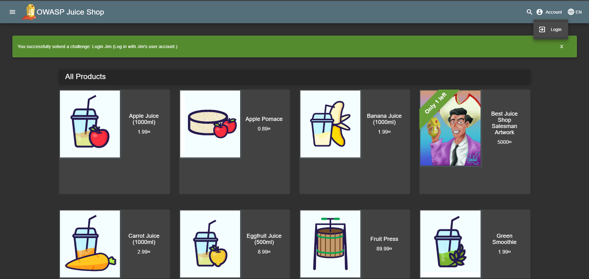
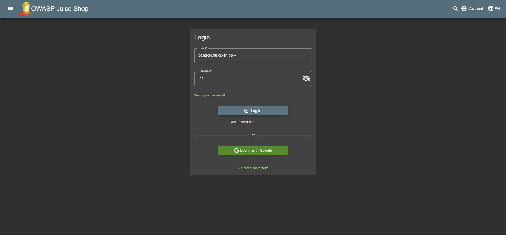

# Login Bender - OWASP Juice Shop

[Login Bender](http://localhost:3000/#/score-board?categories=Injection)

## Langkah-langkah pengerjaan
1. Pada soal sebelumnya ditemukan juga alamat email dengan kata kunci `bender` di bagian review yaitu `bender@juice-sh.op`

2. Kemudian menuju bagian **Login** untuk masuk ke akun

3. Pada bagian login dapat memasukkan alamat email bender dengan menambahkan `'--` untuk dapat bypass login dan bebas untuk bagian passwordnya

## Find and Fix
1. Ditemukan pada baris 15 yang rentan pada SQL Injection karena input user langsung dimasukkan ke query tanpa filtering. Hal ini memungkinkan bypass login dengan payload seperti `' or 1=1 --`

2. Perbaikan dilakukan dengan menggunakan **parameter binding** di Sequelize. Dengan cara ini input user tidak langsung masuk ke query, sehingga aman dari injection
