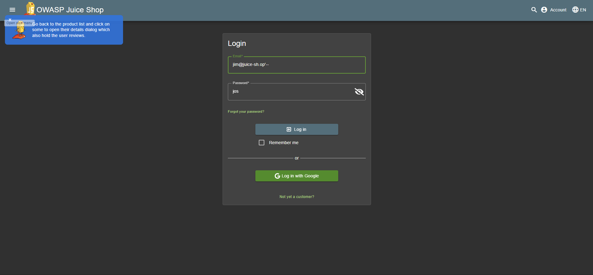

# Login Jim - OWASP Juice Shop

### Detail Informasi
---
Kategori = Injection☠️

[Login Jim](http://localhost:3000/#/score-board?categories=Injection)

## Langkah-langkah Pengerjaan
1. Diminta mencari alamat email dengan kata kuncinya `jim`, dan alamat email tersebut ditemukan pada bagian review produk didapatkan alamat email `jim@juice-sh.op`

2. Kemudian menuju ke bagian menu **Login** untuk masuk ke akun

3. Pada bagian login dapat memasukkan alamat email jim dengan menambahkan `'--` untuk dapat bypass login dan bebas untuk bagian passwordnya

## Find and Fix
1. Ditemukan pada baris 15 yang rentan pada SQL Injection karena input user langsung dimasukkan ke query tanpa filtering. Hal ini memungkinkan bypass login dengan payload seperti `' or 1=1 --`

2. Disini membenarkan bagian yang salah dengan penambahan bagian **$1 dan $2** dengan tujuan memberikan tempat untuk inputan agar tidak langsung tergabung ke querynya

