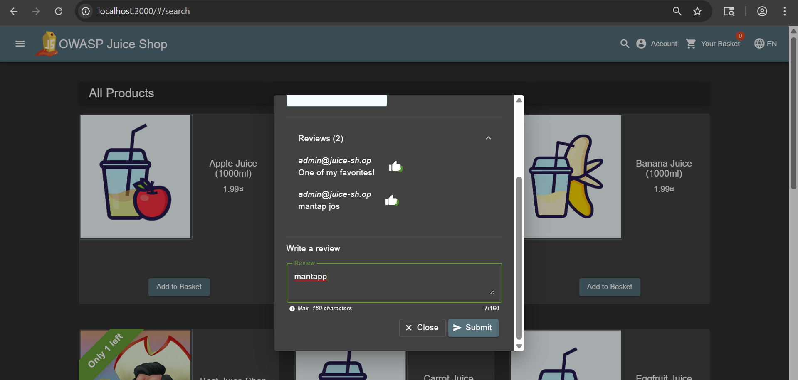
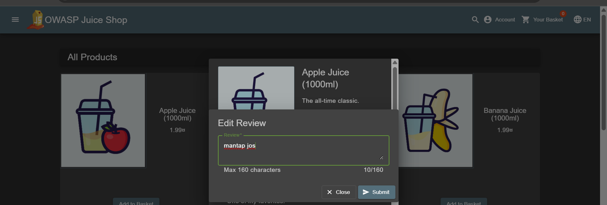
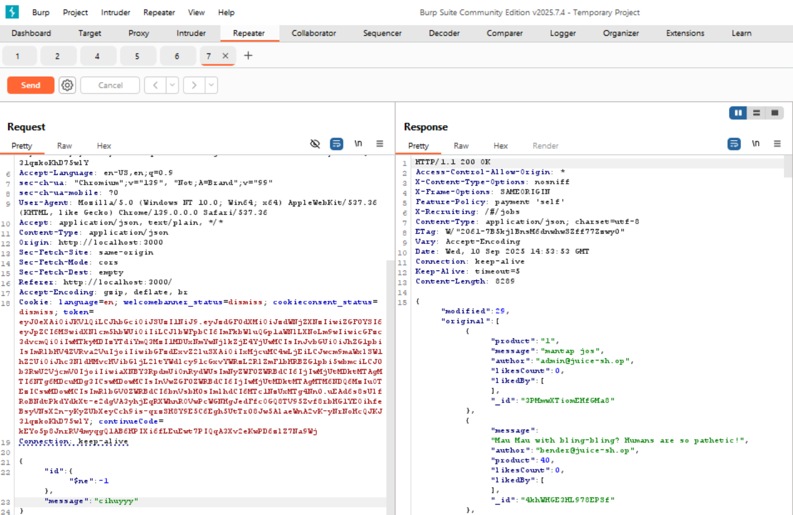
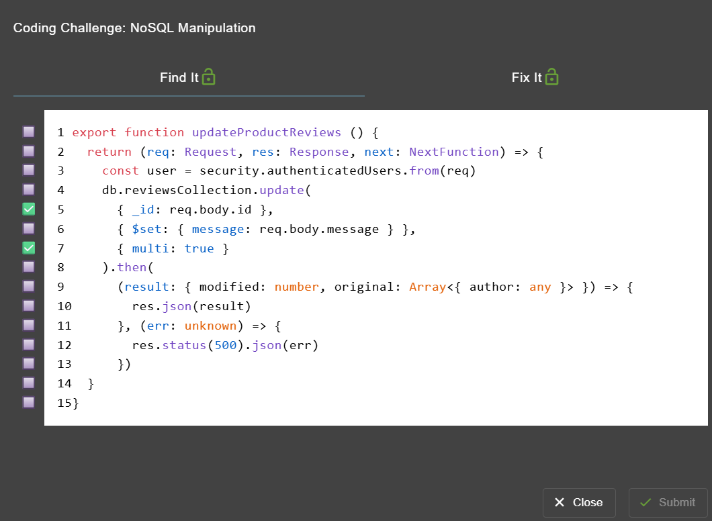
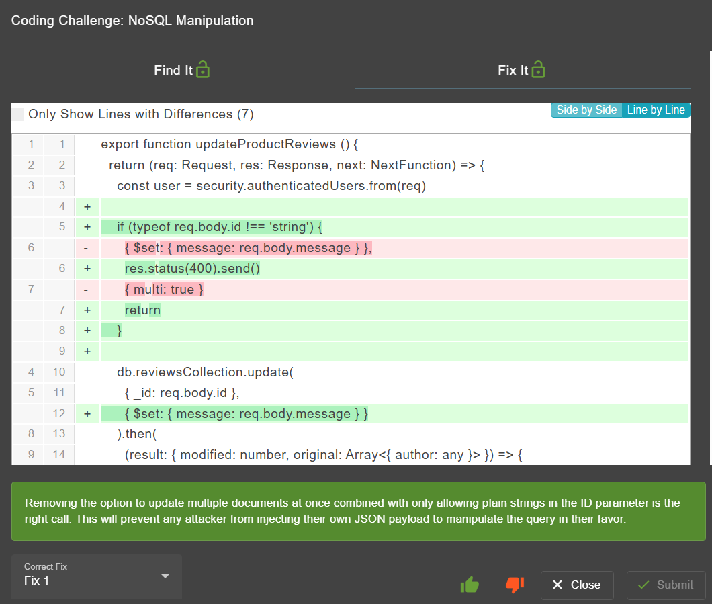

# nosql manipulation - OWASP Juice Shop

>Kategori = Injection☠️

[nosql manipulation](http://localhost:3000/#/score-board?categories=Injection)

---

## Langkah-langkah pengerjaan
1. Memasukkan review random ke item random

2. Ternyata review yang sudah di submit dapat di edit

3. Saat mengecek endpoint yang muncul di burp suite terdapat endpoint menggunakan **PATCH** untuk mengupdate review nya

4. Saat di repeater dapat langsung mengupdate massagenya, disini saya update jadi `cihuyyy` dan setelah di send review berhasil terupdate

## Find and Fix
1.

2.
