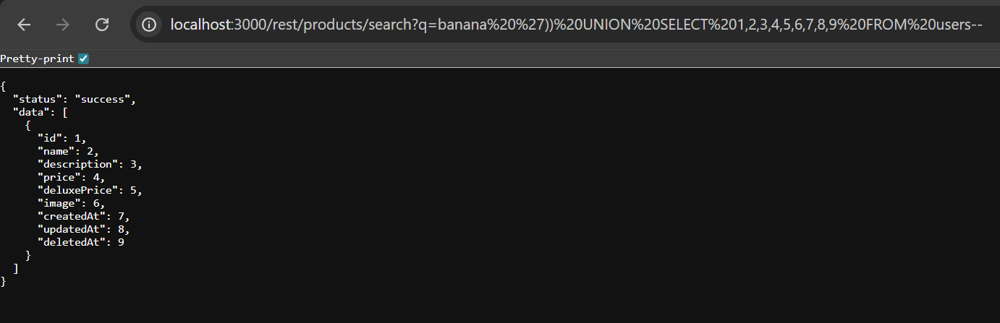
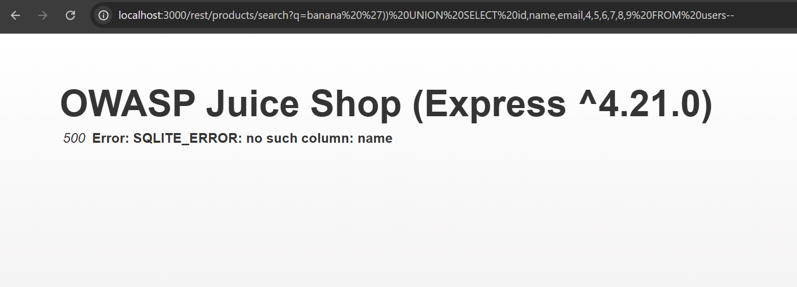
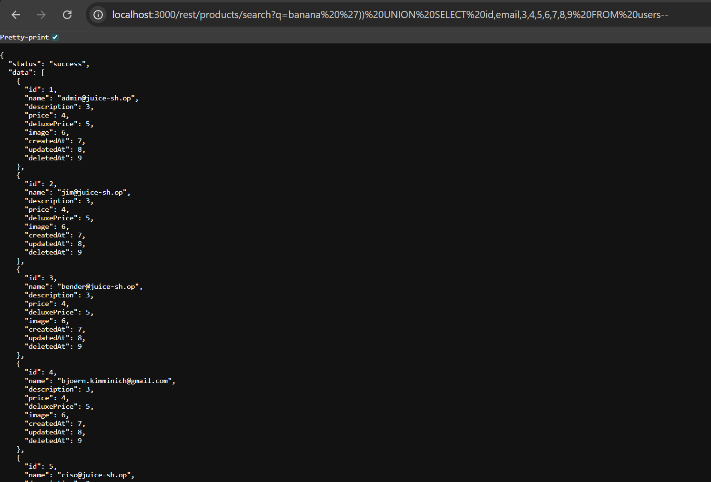
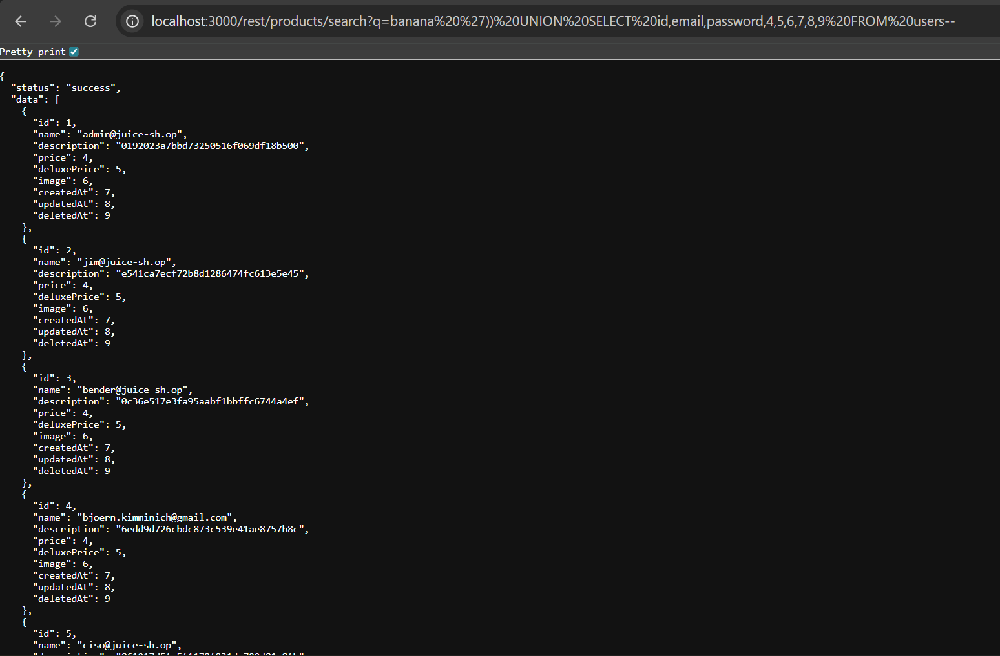
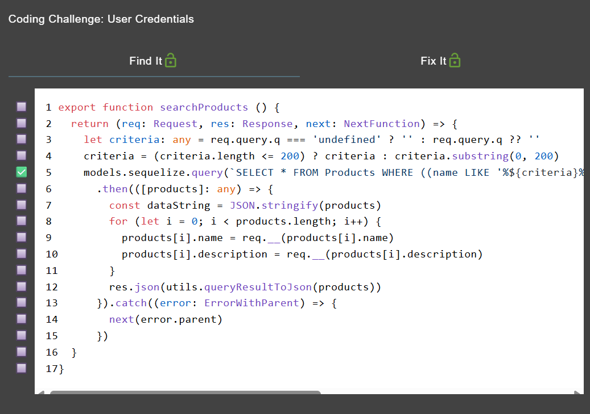
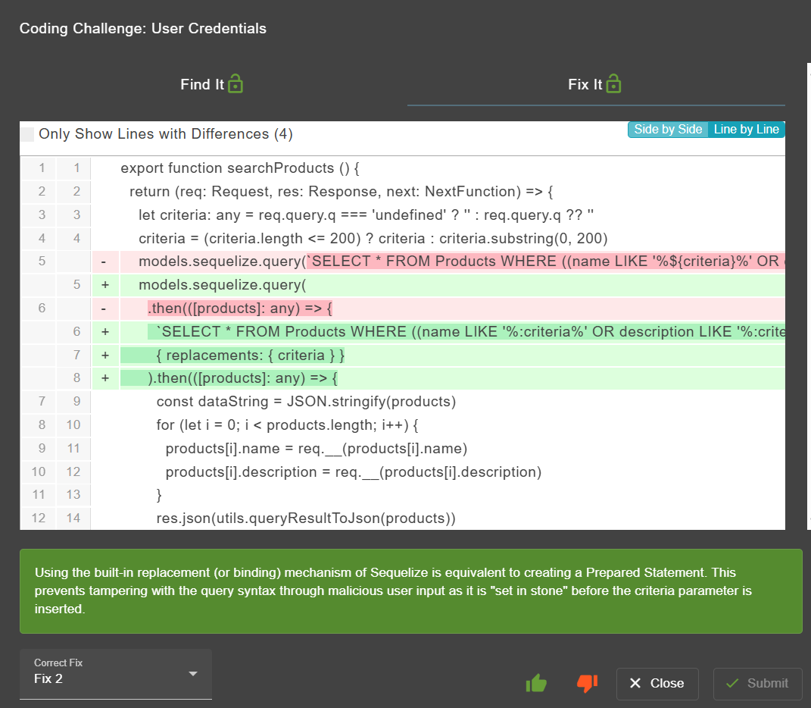

# user credential - OWASP Juice Shop

>Kategori = Injection☠️

[user credential](http://localhost:3000/#/score-board?categories=Injection)

---

## Langkah-langkah pengerjaan
1. Caranya kurang lebih sama seperti pada [database schema](./database%20schema.md), bedanya pada payload yang digunakan untuk menampilkan kolom User
~~~
banana ')) UNION SELECT 1,2,3,4,5,6,7,8,9 FROM users--
~~~

2. Mengganti kolom 1 dengan `id` dan kolom 2 dengan `name` untuk melihat usernya namun ternyata error massage yang muncul

3. Mencoba mengganti kolom 2 dengan `email` dan muncul list dari email yang terdaftar

4. Mencoba mengganti kolom 3 dengan `password` dan muncul list password yang sudah di encrypt menandakan challange sudah berhasil karena menampilkan nama akun dan passwordnya

## Find and Fix
1. Ditemukan pada baris ke 5 dimana query dibentuk langsung dari input user tanpa replacements/binding, sehingga rawan SQL injection dan bisa menyebabkan kebocoran data

2. Perbaikan dilakukan dengan memanfaatkan fitur replacements agar input user tidak langsung dimasukkan ke query dengan begitu serangan SQL injection bisa dicegah dan akses ke database tetap aman
