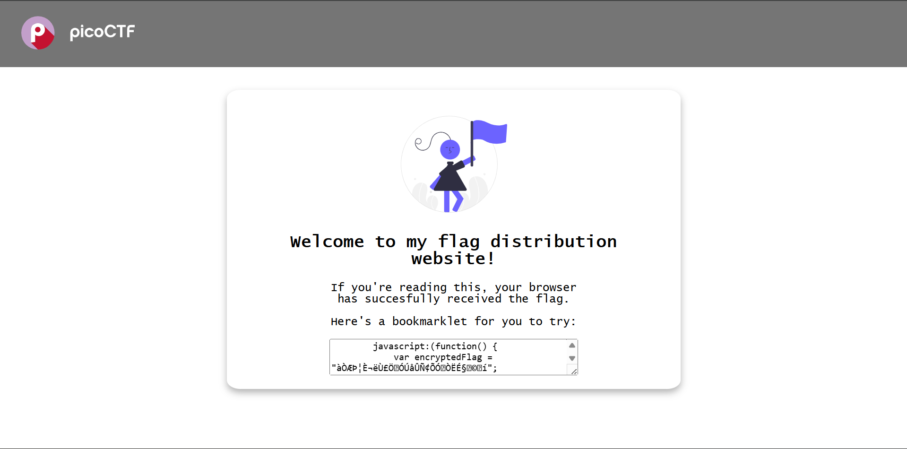
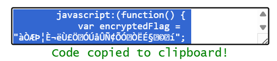
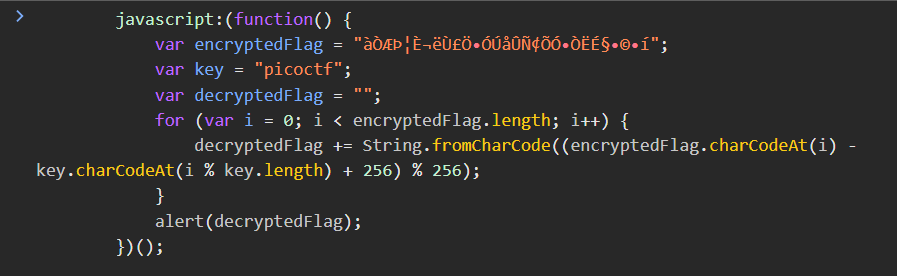

# Inspect HTML - PicoCTF

### Detail Informasi
Kategori = Web Exploitation🖥️

Level = Easy🟢

[Inspect HTML](https://play.picoctf.org/practice/challenge/275?category=1&page=1)

## Langkah-langkah pengerjaan
1. Menuju web yang terdapat di link challange nya

2. Salin kode yang ditampilkan pada halaman web tersebut, lalu inspect halaman dan buka bagian console

3. Masukkan kode yang sudah di salin tadi dan enter

4. Akan muncul pop up yang berisi flag nya
