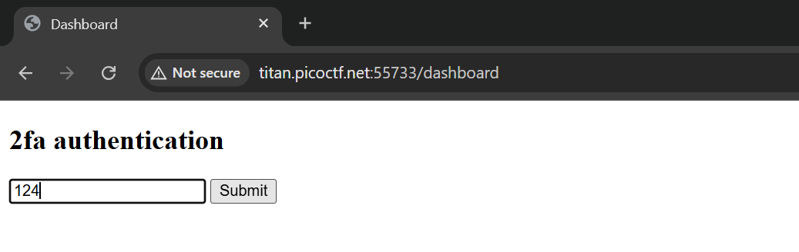

# IntroToBurp - PicoCTF

### Detail Informasi
Kategori = Web Exploitation🖥️

Level = Easy🟢

[IntroToBurp](https://play.picoctf.org/practice/challenge/419?category=1&page=1)

## Langkah-langkah pengerjaan
1. Menuju web yang terdapat di link challange nya dan isi seperti pada gambar ini untuk mencoba masuk

2. Masukkan random kode OTP

3. Hasilnya nanti akan invalid dan bisa beralih ke burp suite untuk cek endpoint yang muncul

4. Muncul endpoint /dashboard dengan metode **POST** pada burp suite nya

5. Hapus bagian `otp` dan send, maka akan muncul response yang menampilkan flag nya
