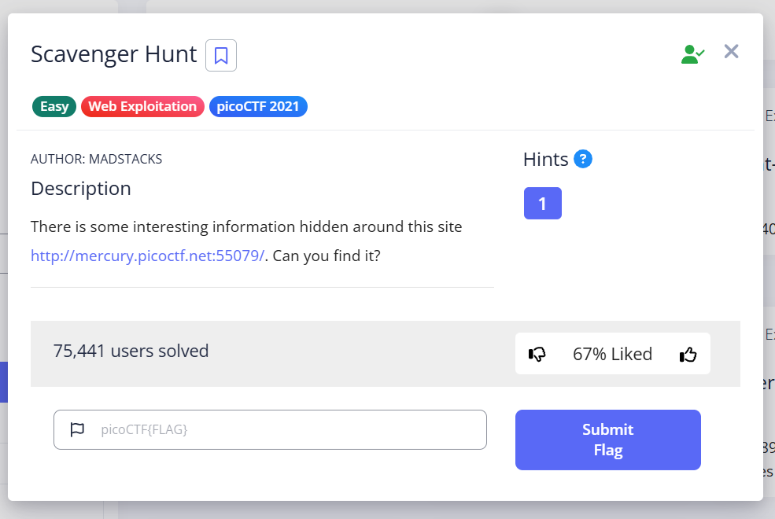
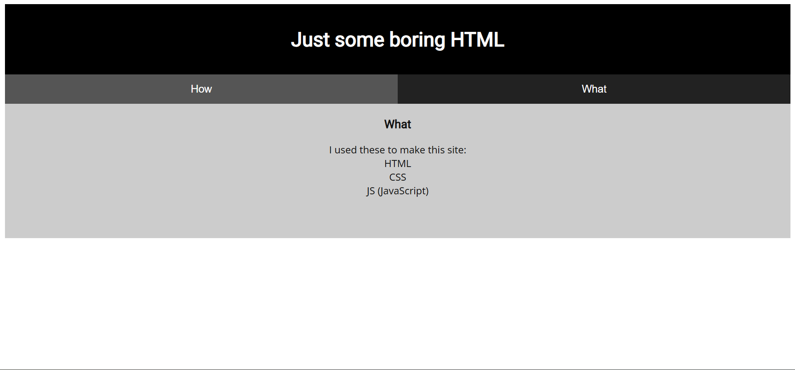
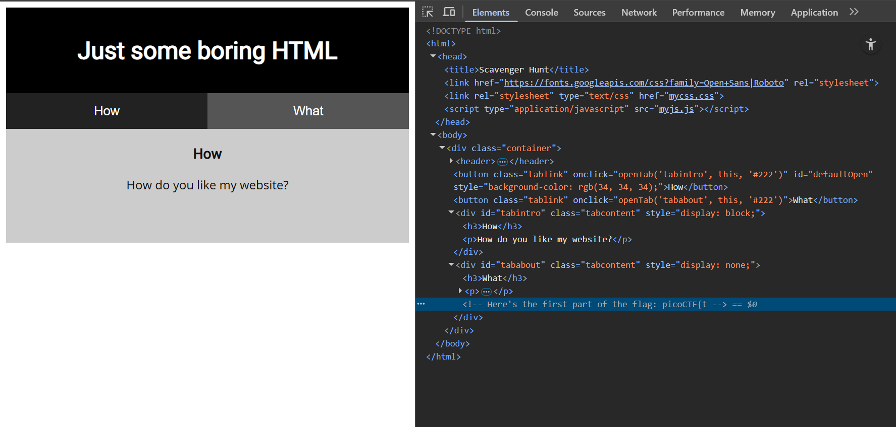
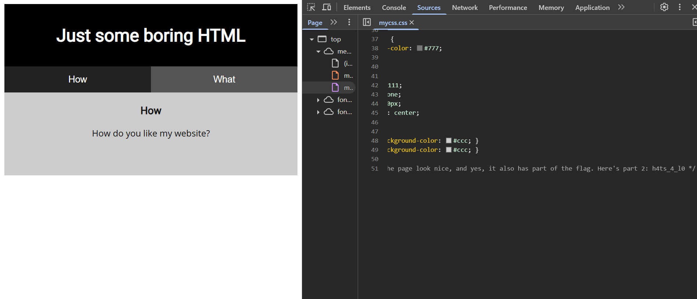
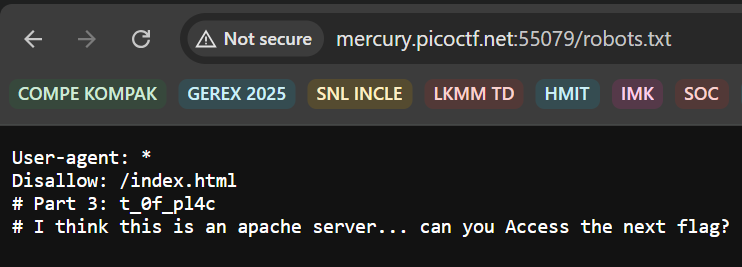
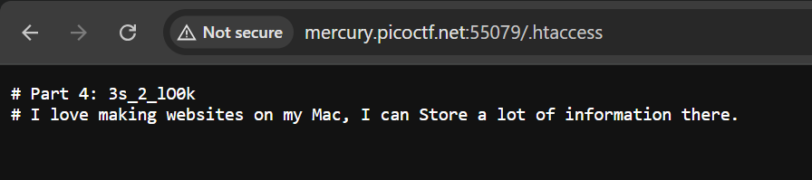
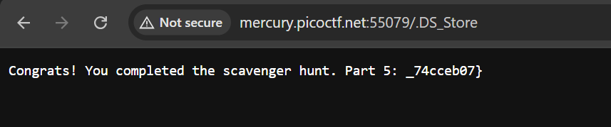
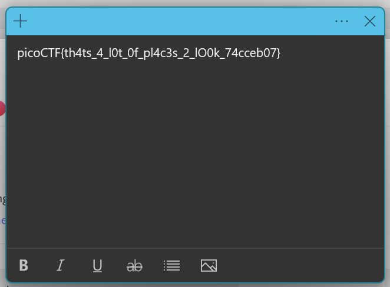

# Scavenger Hunt - PicoCTF

### Detail Informasi
Kategori = Web Exploitation🖥️

Level = Easy🟢

[Scavenger Hunt](https://play.picoctf.org/practice/challenge/161?category=1&page=2)

## Langkah-langkah pengerjaan
1. Menuju web yang terdapat di link challange nya dan memilih yang bagian `What` lalu menuju inspect

2. Saat di inspect terlihat bahwa sudah ditemukan bagian pertama flagnya

3. Kemudian lanjut ke bagian `How` dan di inspect juga untuk menemukan bagian kedua flagnya

4. Mencoba mengakses file `robots.txt` yang biasanya berisi petunjuk terkait bagian apa yang dapat di indeks. Dan benar terdapat bagian ketiga dari flagnya

5. Terdapat clue yang mengatakan bahwa situs ini menggunakan server Apache, biasanya pada server apache memiliki situs tersembunyi dan disini saya mencoba akses `/.htaccess` dan ditemukan bagian keempat flagnya

6. Muncul clue selanjutnya yang menyebutkan pengguna Mac OS dan ini merujuk pada file yang menyimpan meta data pada Mac Os yaitu `DS_Store` sehingga saya mengakses `/.DS_Store` dan ditemukan bagian terakhir dari flagnya

7. Ditemukan flag lengkapnya dari penggabungan bagian-bagian yang ditemukan sebelumnya
