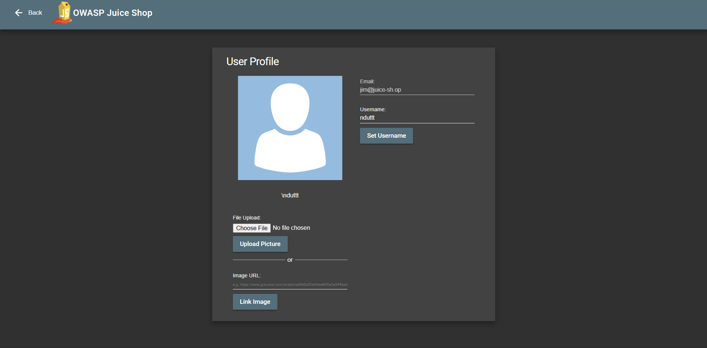
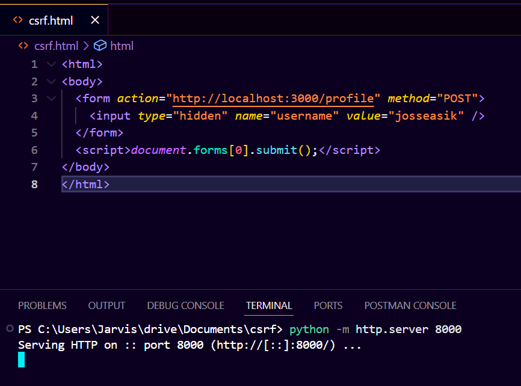
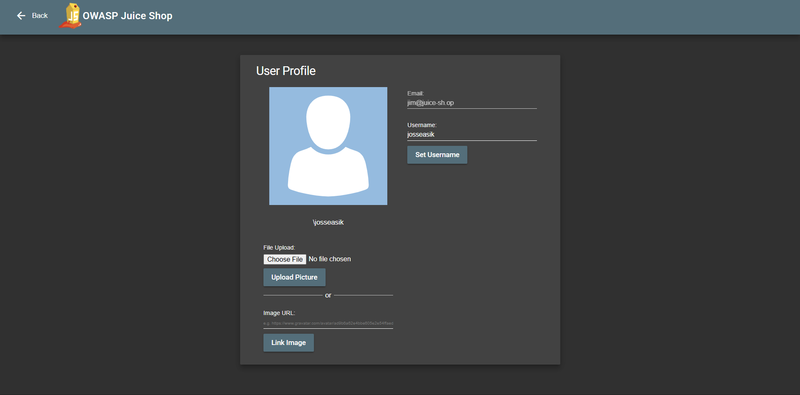

# CSRF
Change the name of a user by performing Cross-Site Request Forgery from another origin.

>Link challenge: [csrf](http://localhost:3000/#/score-board?categories=Broken%20Access%20Control)

## Writeup

1. 

2. 

3.

## Catatan hasil percobaan
