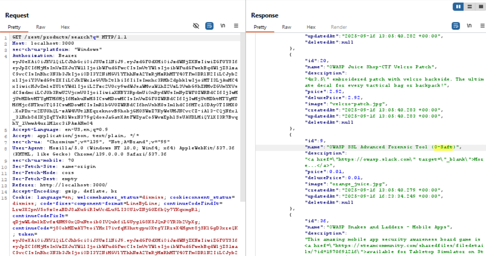

# Product Tampering
Change the href of the link within the OWASP SSL Advanced Forensic Tool (O-Saft) product description into https://owasp.slack.com.

>Link challenge: [product tampering](http://localhost:3000/#/score-board?categories=Broken%20Access%20Control)

## Writeup

1. 

2. 

3.

4.

5. 

6. 

## Catatan hasil percobaan
