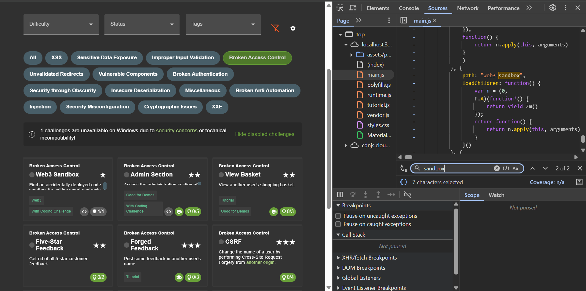
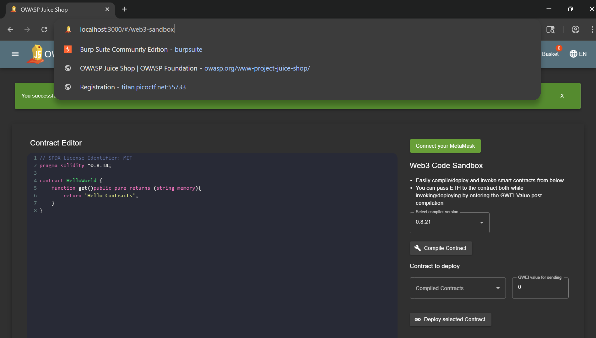
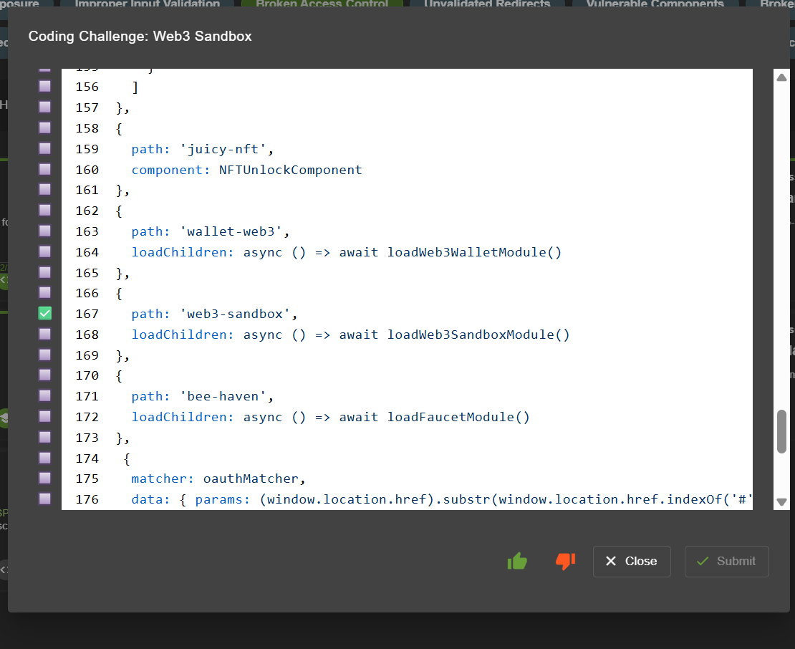
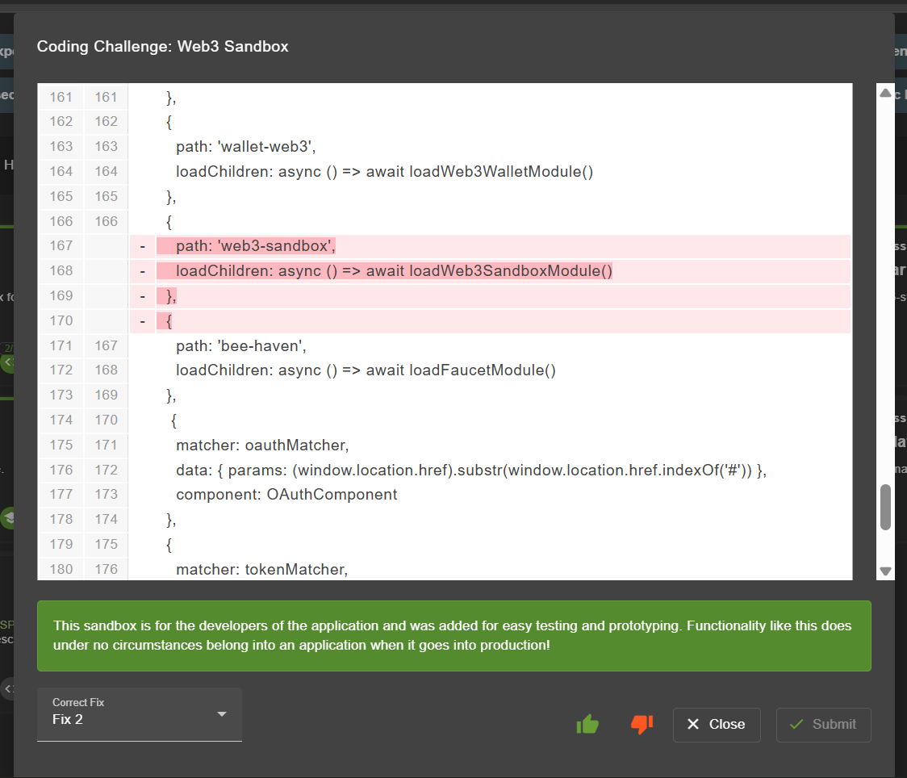

# Web3 Sandbox
Find an accidentally deployed code sandbox for writing smart contracts on the fly.

>Link challenge: [web3 sandbox](http://localhost:3000/#/score-board?categories=Broken%20Access%20Control)

## Writeup

1. Inspect halaman dan menuju bagian *sources* dilanjutkan mencari endpoint `sandbox`

2. Setelah ditemukan, tambahkan endpoint ke dalam url local dan challange berhasil

## Find and Fix
1. Ditemukan alasan user biasa dapat mengakses path sandbox dikarenakan dicantumkan dalam *source*

2. Memperbaiki dengan cara tidak menambahkan path sandbox ke dalam *source*

## Catatan hasil percobaan
- **Hasil percobaan:** Berhasil mengakses endpoint `sandbox` meskipun tidak memiliki hak akses khusus.  
- **Alasan:** Endpoint `sandbox` secara tidak sengaja terekspos di *source code* sehingga dapat ditemukan oleh user biasa hanya dengan melakukan inspeksi.  
- **Refleksi:** Hal ini menunjukkan pentingnya tidak mengekspose endpoint sensitif di sisi client, karena informasi tersebut bisa dengan mudah ditemukan oleh attacker. Sebaiknya dilakukan validasi akses di sisi server dan memastikan hanya role tertentu yang dapat mengakses `sandbox`.