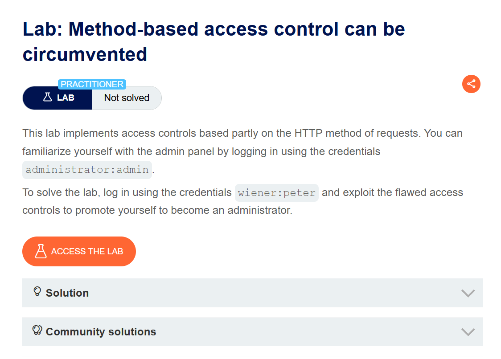
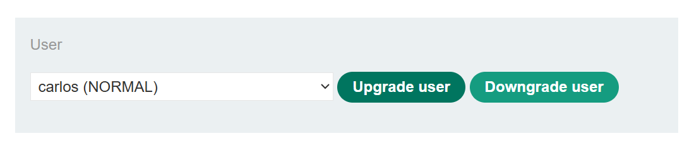
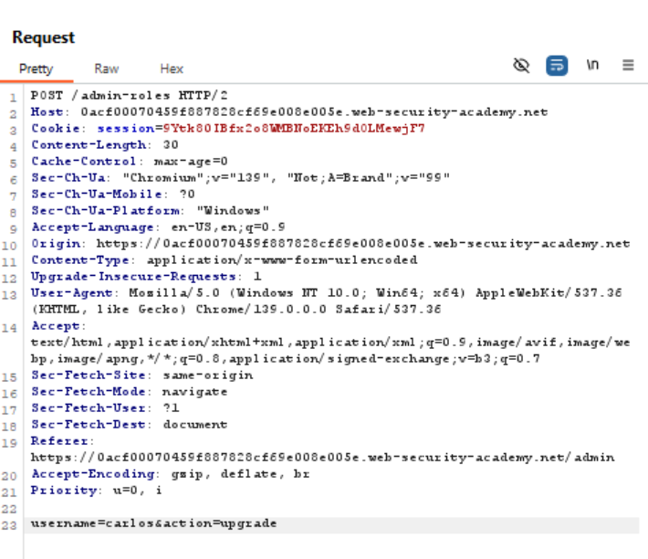
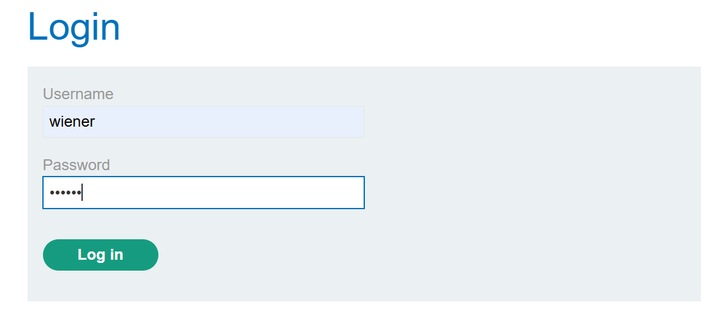
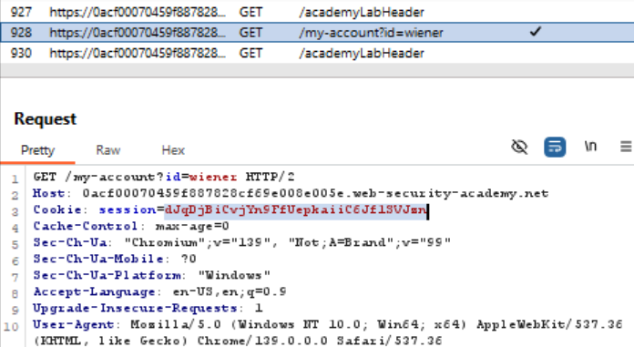
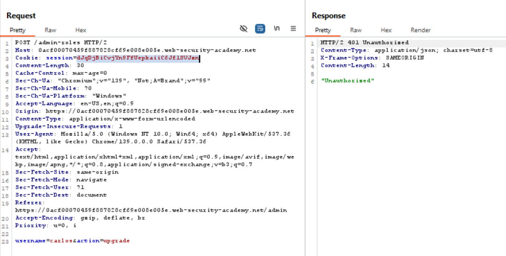
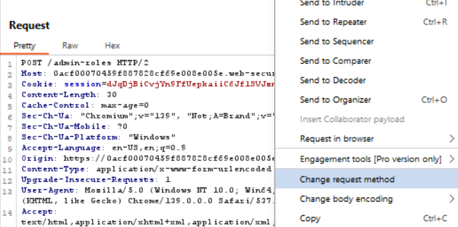
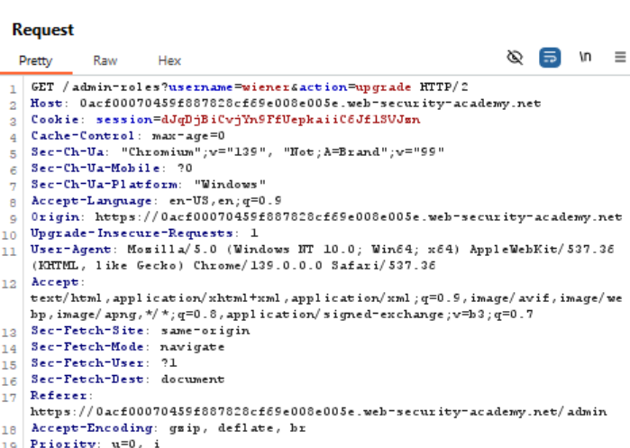
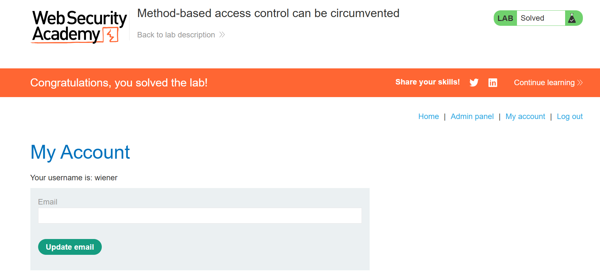

# Method-based access control can be circumvented
This lab implements access controls based partly on the HTTP method of requests. You can familiarize yourself with the admin panel by logging in using the credentials `administrator:admin`.

To solve the lab, log in using the credentials `wiener:peter` and exploit the flawed access controls to promote yourself to become an administrator.

>Link challenge: [method-based](https://portswigger.net/web-security/access-control/lab-method-based-access-control-can-be-circumvented)
## Writeup

1. 

2. 

3.

4.

5.

6.

7.

8.

9.

10.

## Catatan hasil percobaan
