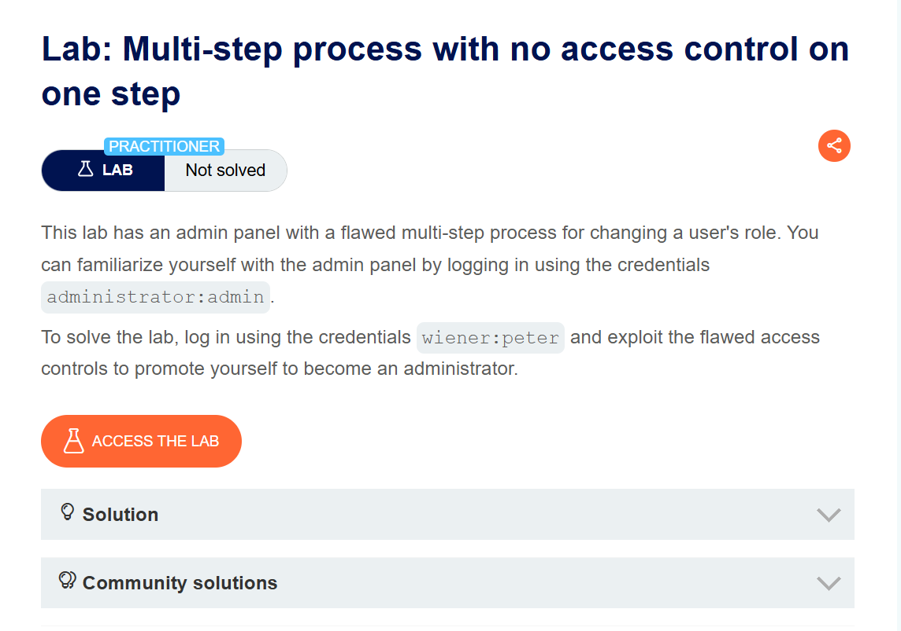
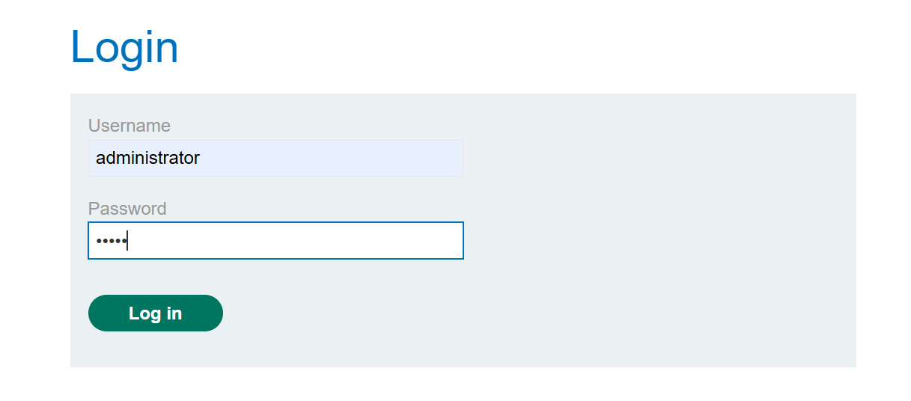
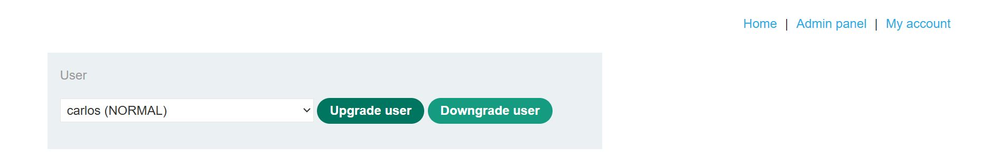
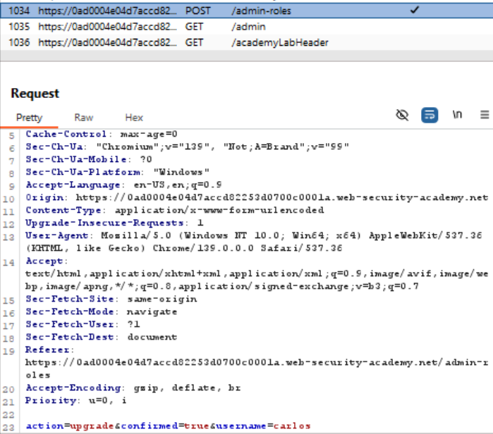
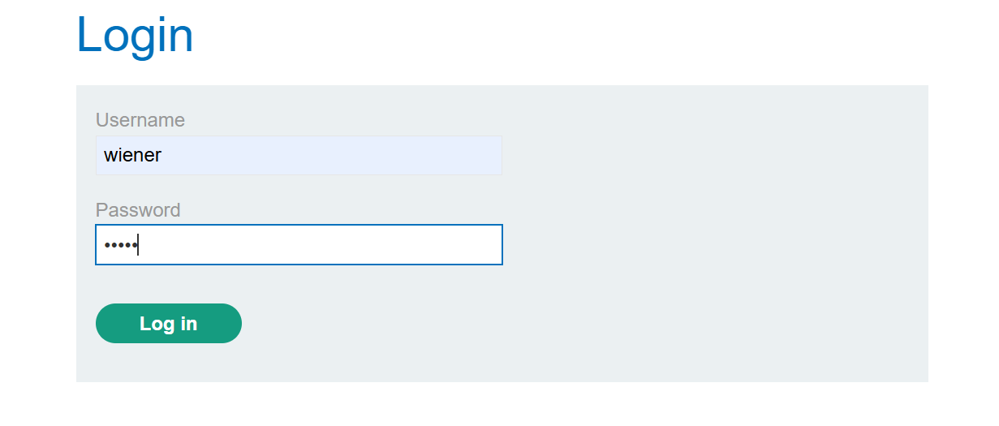
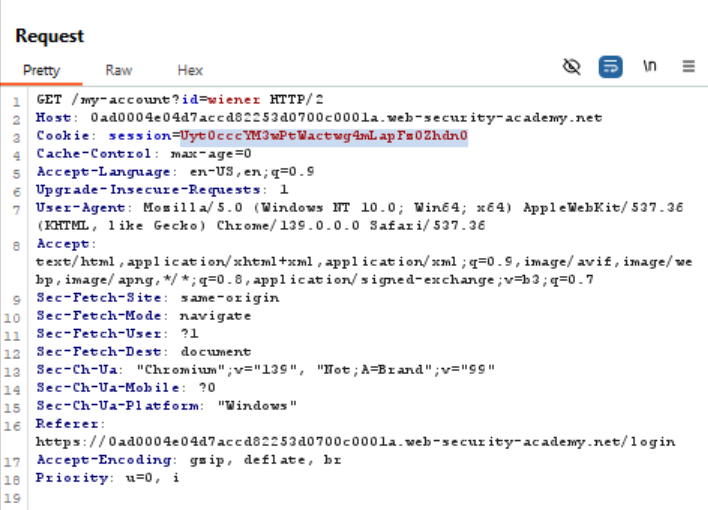
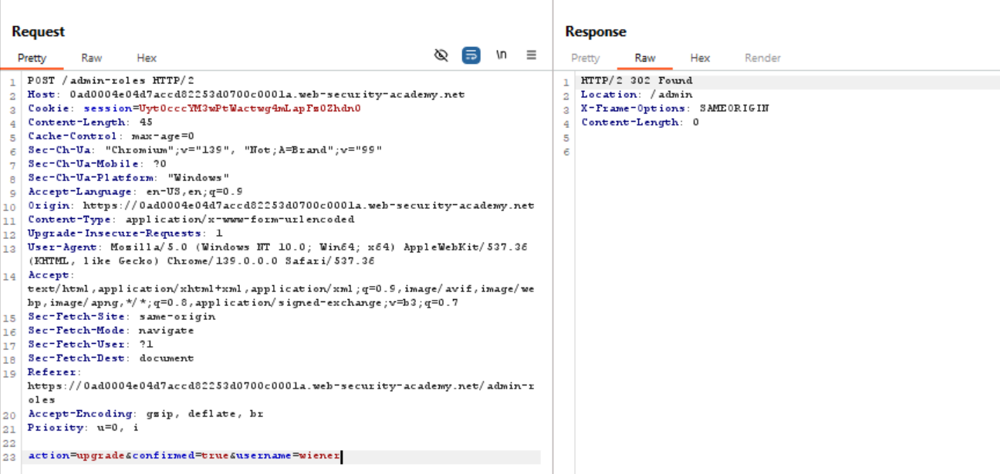
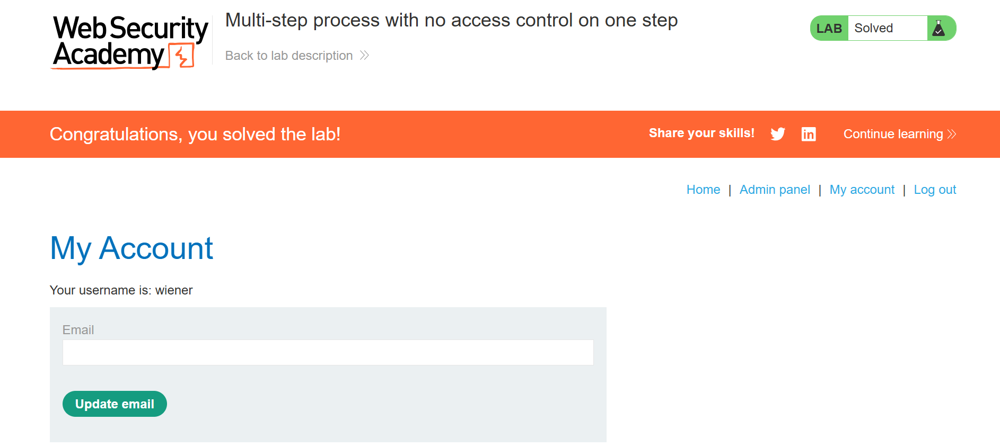

# Multi-step process with no access control on one step
This lab has an admin panel with a flawed multi-step process for changing a user's role. You can familiarize yourself with the admin panel by logging in using the credentials `administrator:admin.`

To solve the lab, log in using the credentials `wiener:peter` and exploit the flawed access controls to promote yourself to become an administrator.

>Link challenge: [multi-step](https://portswigger.net/web-security/access-control/lab-multi-step-process-with-no-access-control-on-one-step)
## Writeup

1. 

2. 

3.

4.

5.

6.

7.

8.

## Catatan hasil percobaan
