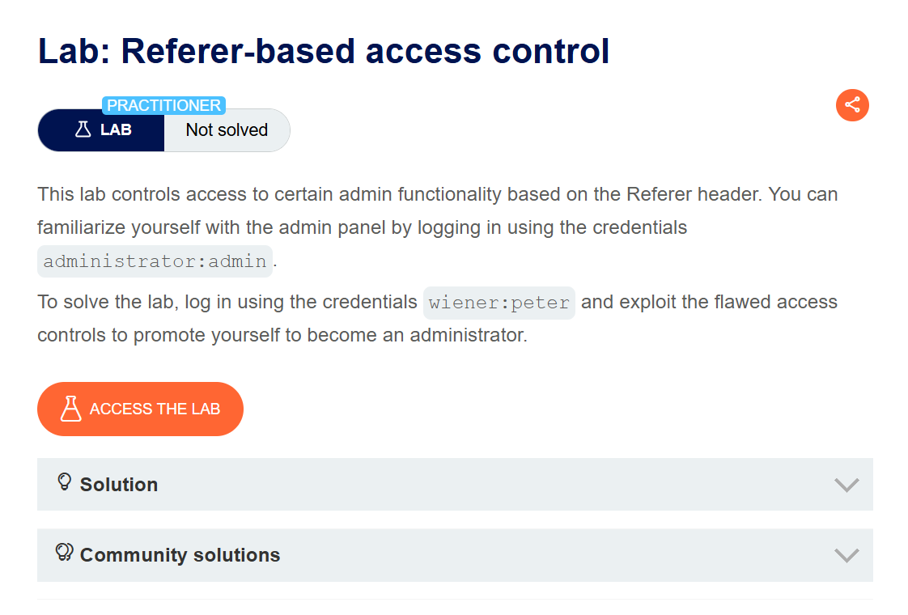
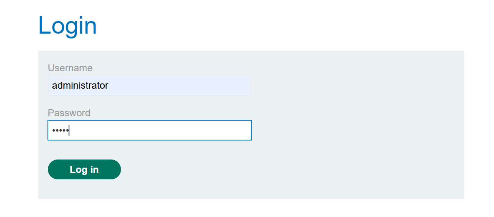
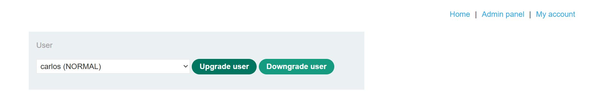
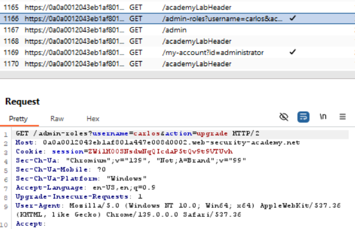
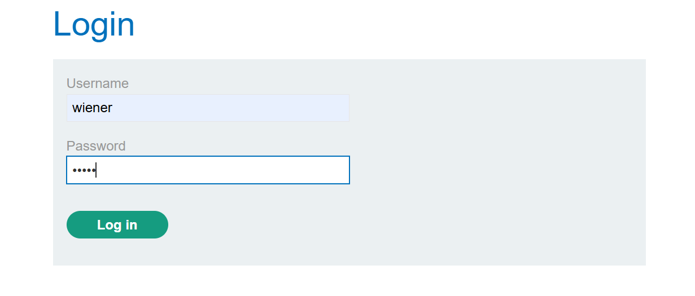
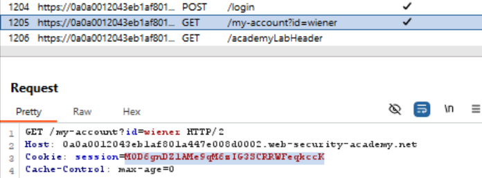
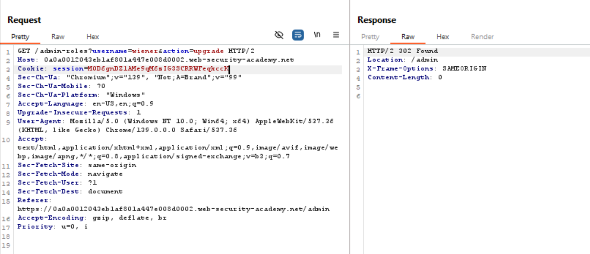
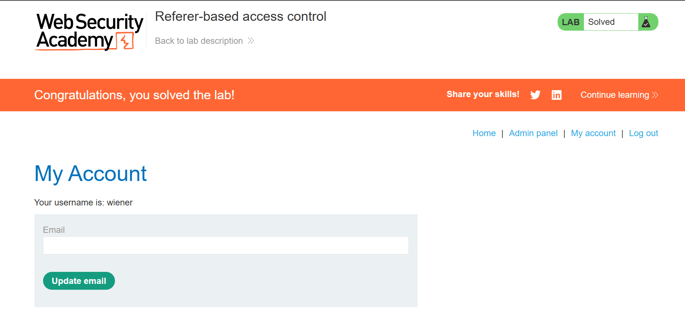

# Referer-based access control
This lab controls access to certain admin functionality based on the Referer header. You can familiarize yourself with the admin panel by logging in using the credentials `administrator:admin`.

To solve the lab, log in using the credentials `wiener:peter` and exploit the flawed access controls to promote yourself to become an administrator.

>Link challenge: [referer-based](https://portswigger.net/web-security/access-control/lab-referer-based-access-control)
## Writeup

1. 

2. 

3.~

4.

5.

6.

7.

8.

## Catatan hasil percobaan
