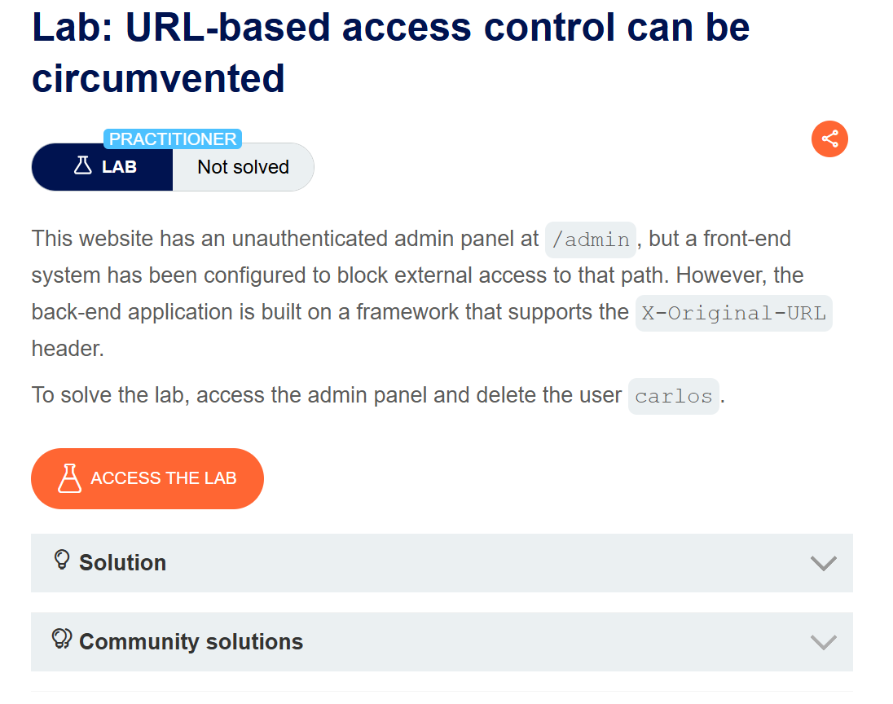
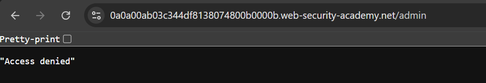
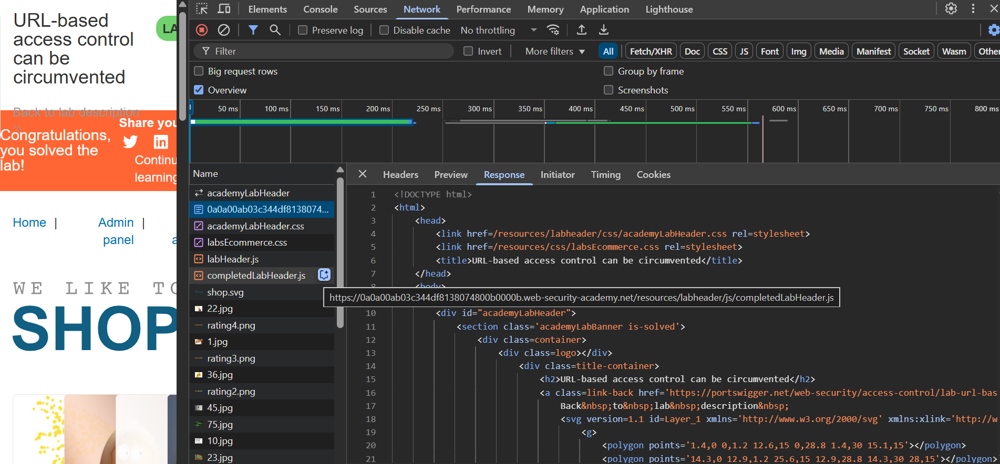
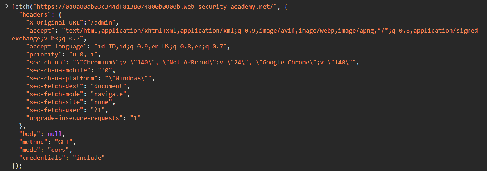
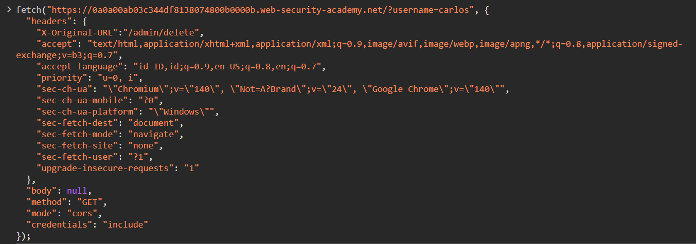
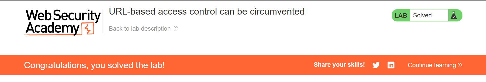

# URL-based access control can be circumvented
This website has an unauthenticated admin panel at `/admin`, but a front-end system has been configured to block external access to that path. However, the back-end application is built on a framework that supports the `X-Original-URL` header.

To solve the lab, access the admin panel and delete the user `carlos`.

>Link challenge: [url-based](https://portswigger.net/web-security/access-control/lab-url-based-access-control-can-be-circumvented)

## Writeup

1. 

2. 

3.

4.

5.

6.

## Catatan hasil percobaan
